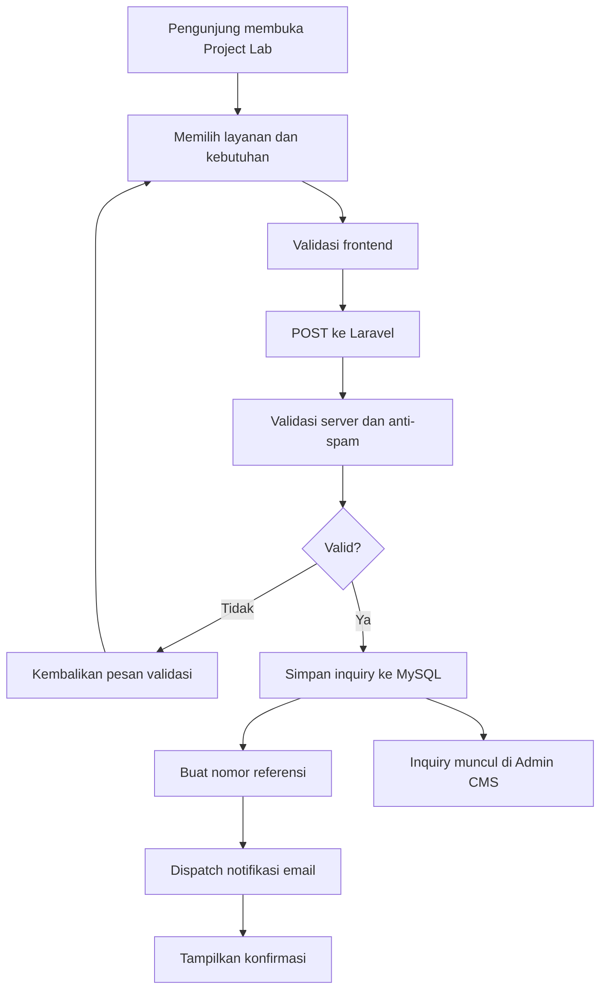

```mermaid

flowchart TD
    A["Pengunjung membuka Project Lab"] --> B["Memilih layanan dan kebutuhan"]
    B --> C["Validasi frontend"]
    C --> D["POST ke Laravel"]
    D --> E["Validasi server dan anti-spam"]
    E --> F{"Valid?"}
    F -- "Tidak" --> G["Kembalikan pesan validasi"]
    G --> B
    F -- "Ya" --> H["Simpan inquiry ke MySQL"]
    H --> I["Buat nomor referensi"]
    I --> J["Dispatch notifikasi email"]
    J --> K["Tampilkan konfirmasi"]
    H --> L["Inquiry muncul di Admin CMS"]
```
